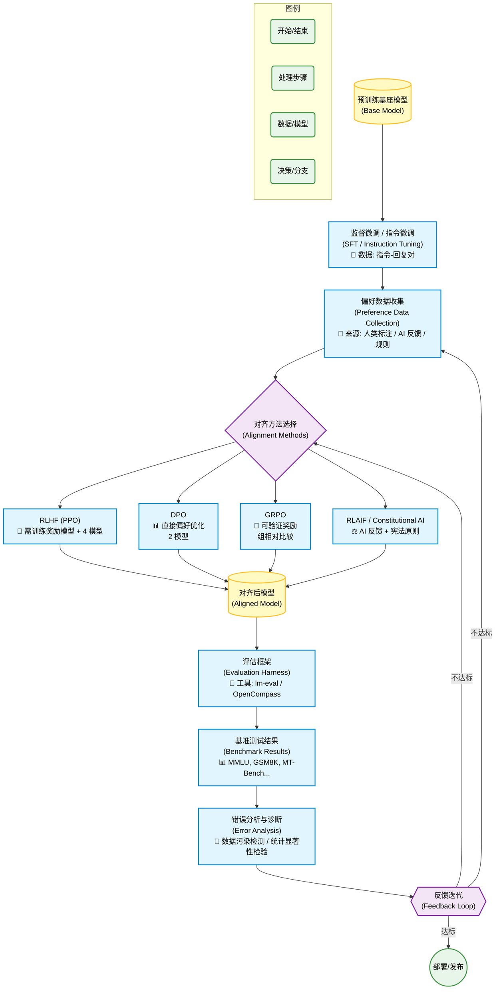

# Project2_TaskB_Survey · 大语言模型 Post-Training 技术调研

> **课程项目**：大语言模型 Post-Training 技术调研  
> **选择任务**：**任务 B**（技术理解、文献调研、方法比较和工具解释）  
> **所属仓库**：本目录为 Project2_TaskB_Survey 的完整提交

---

## 目录

1. [任务选择说明](#1-任务选择说明)
2. [小组成员及分工](#2-小组成员及分工)
3. [报告主题和主要内容](#3-报告主题和主要内容)
4. [调研的代表性论文、文档和开源项目](#4-调研的代表性论文文档和开源项目)
5. [技术路线图说明](#5-技术路线图说明)
6. [Evaluation Harness 示例命令说明](#6-evaluation-harness-示例命令说明)
7. [小组对 LLM Post-Training 技术的总结和理解](#7-小组对-llm-post-training-技术的总结和理解)

---

## 1. 任务选择说明

### 1.1 为什么选择任务 B

本小组选择 **任务 B**，核心原因如下：

| 考量因素 | 说明 |
|---------|------|
| **资源条件** | 任务 B 侧重技术理解、文献调研、方法比较和工具解释，适合没有足够显卡资源的小组。我们不需要运行大规模的模型训练实验，而是深入理解 Post-Training 各环节的原理和设计思路 |
| **学习目标** | 本项目的核心目标是理解大语言模型 Post-Training 的基本思想（Instruction Fine-tuning、Alignment 和 Evaluation），而非比较谁使用了更大的模型或更强的显卡。任务 B 的设计完美匹配这一目标 |
| **能力培养** | 任务 B 要求系统调研文献、对比方法优劣、撰写技术报告，培养的是文献综述能力、技术分析能力和工程文档能力——这些是 AI 领域最核心的可迁移技能 |
| **工具实践** | 虽然不需要训练模型，但任务 B 仍要求掌握 Evaluation Harness 等工具的使用，确保理论理解与动手能力并重 |

### 1.2 任务 B 的交付要求

根据项目说明，任务 B 要求：

> 小组需要系统调研并解释大语言模型从预训练模型到指令模型、对齐模型以及评估体系的关键技术路线。
>
> 围绕 **Fine-tuning**、**Alignment** 和 **Evaluation Harness** 三个主题，完成结构清晰、内容准确、有技术细节的调研报告，并将报告、图表、参考资料和示例命令提交到 GitHub 仓库。同时需要在**小雅平台**提交相关材料。

---

## 2. 小组成员及分工

本小组共 **1 名成员**，分工如下：

| 成员 | 角色 | 负责内容 |
|------|------|---------|
| 胡亚鑫 | 组长 / Fine-tuning & Evaluation 负责人 | ① Fine-tuning 技术调研与报告撰写（SFT / LoRA / QLoRA / Alpaca）；② Evaluation 技术调研与报告撰写（Benchmark 体系、lm-eval 工具、统计检验）；③ 技术路线图设计（Mermaid 图表）；④ 数据格式与超参数章节；⑤ Evaluation Harness 示例命令编写与测试 |
| 赵子仪 | Alignment 负责人 / 综合整合 | ① Alignment 技术调研与报告撰写（RLHF / DPO / GRPO / RLAIF / Constitutional AI）；② Method 数学推导与对比分析；③ 偏好数据集调研与整理；④ 参考文献整理与校对；⑤ 报告统稿、格式校对与 GitHub 仓库管理；⑥ 端到端管线案例分析撰写 |

### 协作流程

```
A (Fine-tuning + Evaluation)
  │
  ├── 撰写 SFT/LoRA/QLoRA 章节
  ├── 撰写 Benchmark/lm-eval 章节
  ├── 编写 lm-eval 命令示例
  └── 设计技术路线图 (Mermaid)

B (Alignment + 整合)
  │
  ├── 撰写 RLHF/DPO/GRPO 章节
  ├── 撰写方法对比与选型章节
  ├── 整理参考文献
  ├── 统稿与格式校对
  └── GitHub 仓库管理 + 小雅平台提交
```

---

## 3. 报告主题和主要内容

### 3.1 报告主题

本报告围绕大语言模型 **Post-Training（训练后优化）** 的三大核心主题展开系统调研：

```
预训练基座模型 (Base Model)
       │
       ▼
┌─────────────────────────────────────┐
│  ① Fine-tuning（指令微调）            │
│  ─────────────────────               │
│  核心问题：如何让模型学会遵循指令？    │
│  方法：SFT / Full FT / LoRA / QLoRA  │
│  案例：Alpaca / LoRA / QLoRA         │
└──────────────┬──────────────────────┘
               │
               ▼
┌─────────────────────────────────────┐
│  ② Alignment（对齐）                 │
│  ─────────────────────               │
│  核心问题：如何让输出符合人类偏好？    │
│  方法：RLHF / DPO / GRPO / RLAIF    │
│  案例：InstructGPT / DPO / DeepSeek  │
└──────────────┬──────────────────────┘
               │
               ▼
┌─────────────────────────────────────┐
│  ③ Evaluation（系统评估）            │
│  ─────────────────────               │
│  核心问题：如何系统衡量模型能力？     │
│  工具：lm-evaluation-harness         │
│  案例：MMLU / GSM8K / 自定义任务     │
└─────────────────────────────────────┘
```

### 3.2 报告结构

| 章节 | 核心内容 |
|------|---------|
| **第 1 章：引言与背景** | Post-Training 的定义、三阶段管线、为什么需要 Post-Training（行为鸿沟） |
| **第 2 章：小组分工** | A、B 两位成员的详细分工说明 |
| **第 3 章：Post-Training 概述** | 什么是 Post-Training、为什么不能只做 SFT（SFT 盲区分析）、评估的必要性 |
| **第 4 章：Fine-tuning** | SFT 数学定义与 Loss Masking；Full FT vs PEFT 对比（含显存精确分析）；**3 个案例分析**：Alpaca（Self-Instruct 数据合成）、LoRA（低秩适配理论）、QLoRA（NF4 量化技术） |
| **第 5 章：Alignment** | 方法全景图（RLHF/DPO/GRPO/RLAIF）；**3 个案例分析**：InstructGPT/RLHF（三阶段完整推导）、DPO（配分函数抵消的数学巧）、DeepSeek-R1/GRPO（组内比较机制） |
| **第 6 章：Evaluation** | 两种评估模式（Log-likelihood vs 生成式）对比；核心指标数学定义；**3 个案例分析**：MMLU（多项选择评估）、GSM8K（生成式数学推理评估）、自定义评估任务（YAML 定义）；统计检验（McNemar / Bootstrap） |
| **第 7 章：综合案例分析** | 端到端管线（SFT → DPO → GRPO → 评估 → 迭代决策树） |
| **第 8 章：方法对比与总结** | 选型决策树、方法一句话总结、发展趋势 |
| **第 9 章：参考文献** | 核心论文、开源项目、本地文档索引 |

### 3.3 每个案例的统一分析框架

报告中的每个案例都按以下 8 维度框架展开，确保横向可比：

```
┌─────────────────────────────────────────────┐
│  ① 解决什么问题  —— 动机与定位                 │
│  ② 输入数据      —— 数据格式、来源、规模       │
│  ③ 输出结果      —— 产出什么                   │
│  ④ 数学原理      —— 优化目标 + 关键公式         │
│  ⑤ 基本流程      —— 关键步骤                   │
│  ⑥ 优点          —— 核心优势                   │
│  ⑦ 局限性        —— 主要缺点和挑战             │
│  ⑧ Post-training 位置 —— 在管线中的定位        │
└─────────────────────────────────────────────┘
```

### 3.4 报告的关键技术细节

报告包含以下技术深度的核心内容：

| 技术点 | 涵盖内容 |
|-------|---------|
| **SFT Loss Masking** | 指令部分 mask 的数学形式 $M_i \in \{0,1\}$ 和实现逻辑 |
| **Full FT 显存公式** | $P + P + 2P + \text{激活值} = 7B \times 16 \text{ bytes}$ 的精确推导 |
| **LoRA 低秩分解** | SVD 视角 + Eckart-Young-Mirsky 定理 + 参数量计算 |
| **QLoRA NF4 量化** | 正态分布分位数公式 $q_i = \Phi^{-1}(\frac{i}{16} + \frac{1}{32})$ + 双重量化数学形式 |
| **RLHF 三阶段推导** | Bradley-Terry 模型 $\sigma(r_w - r_l)$ + PPO clipped objective + KL 约束 |
| **DPO 配分函数抵消** | 四步推导：解析解 → 反解 → 代入 Bradley-Terry → $Z(x)$ 抵消 |
| **GRPO 组内 Advantage** | $\hat{A}_i = (r_i - \mu_G) / \sigma_G$ + 完整 G=8 计算示例 |
| **Log-likelihood 评估** | $\text{score}(a_i) = \sum \log P(a_i^{(t)} \mid \text{prompt})$ + 长度归一化 $acc\_norm$ |
| **统计检验** | McNemar $\chi^2 = (n_{01} - n_{10})^2 / (n_{01} + n_{10})$ + Bootstrap 置信区间 |

---

## 4. 调研的代表性论文、文档和开源项目

### 4.1 核心论文

| # | 论文 | 发表年份 | 主题归属 | 核心贡献 |
|---|------|---------|---------|---------|
| 1 | **InstructGPT** — Ouyang et al., *Training language models to follow instructions with human feedback* | 2022 | Alignment / RLHF | 第一个系统展示 RLHF 三阶段管线有效性的工作，ChatGPT 的方法论基础 |
| 2 | **DPO** — Rafailov et al., *Direct Preference Optimization: Your Language Model is Secretly a Reward Model* | 2023 | Alignment / DPO | 用分类损失替代 RLHF 的复杂流程，配分函数抵消的数学巧 |
| 3 | **DeepSeek-R1** — DeepSeek-AI, *Incentivizing Reasoning Capability in LLMs via Reinforcement Learning* | 2025 | Alignment / GRPO | GRPO + 可验证奖励，纯 RL 涌现推理能力，AIME 15.6%→71.0% |
| 4 | **Constitutional AI** — Bai et al., *Harmlessness from AI Feedback* | 2022 | Alignment / RLAIF | 用宪法原则引导 AI 自我修正，可审计的价值观对齐框架 |
| 5 | **RLAIF** — Lee et al., *Scaling Reinforcement Learning from Human Feedback with AI Feedback* | 2023 | Alignment / RLAIF | 用 AI 替代人类标注偏好，解决 RLHF 的可扩展性瓶颈 |
| 6 | **LoRA** — Hu et al., *Low-Rank Adaptation of Large Language Models* | 2021 | Fine-tuning / PEFT | 低秩矩阵参数化权重更新，0.1% 参数达到 95%+ Full FT 效果 |
| 7 | **QLoRA** — Dettmers et al., *Efficient Finetuning of Quantized Language Models* | 2023 | Fine-tuning / 量化 | NF4 + 双重量化 + 分页优化器，65B 模型单卡微调 |
| 8 | **Alpaca** — Taori et al., *A Strong, Replicable Instruction-Following Model* | 2023 | Fine-tuning / SFT | $100 复现 GPT-3.5 级别指令跟随，Self-Instruct 数据合成 |
| 9 | **Self-Instruct** — Wang et al., *Aligning Language Models with Self-Generated Instructions* | 2022 | Fine-tuning / 数据 | 种子指令 + 强模型扩展的数据合成方法论 |
| 10 | **MMLU** — Hendrycks et al., *Measuring Massive Multitask Language Understanding* | 2020 | Evaluation / 基准 | 57 学科 ~15,908 题，LLM 知识广度最常用基准 |
| 11 | **GSM8K** — Cobbe et al., *Training Verifiers to Solve Math Word Problems* | 2021 | Evaluation / 基准 | 8,500 道小学数学应用题，多步推理评估标准 |
| 12 | **lm-eval** — Gao et al., *A Framework for Few-Shot Language Model Evaluation* | 2023 | Evaluation / 框架 | EleutherAI 开源评估框架，200+ 预定义任务 |
| 13 | **HELM** — Liang et al., *Holistic Evaluation of Language Models* | 2022 | Evaluation / 框架 | Stanford CRFM，7 维度全面评估框架 |
| 14 | **ORPO** — Hong et al., *Monolithic Preference Optimization without Reference Model* | 2024 | Alignment / DPO 变体 | SFT + 偏好联合训练，单阶段完成 |
| 15 | **SimPO** — Meng et al., *Simple Preference Optimization with a Reference-Free Reward* | 2024 | Alignment / DPO 变体 | 平均对数概率 + 长度归一化 + margin |
| 16 | **DoRA** — Liu et al., *Weight-Decomposed Low-Rank Adaptation* | 2024 | Fine-tuning / LoRA改进 | 幅度/方向解耦，↑ 1-3% |
| 17 | **PiSSA** — Meng et al., *Principal Singular Values and Singular Vectors Adaptation* | 2024 | Fine-tuning / LoRA改进 | SVD 主成分初始化，少数据场景更优 |

### 4.2 核心技术文档（本系列三份笔记）

| 文档 | 文件 | 核心内容 |
|------|------|---------|
| **《Fine-tuning 技术笔记》** | [`/2/finetuning_notes.md`](../finetuning_notes.md) | SFT/LoRA/QLoRA 完整解析、本征维度理论、PEFT 变体对比、数据格式、超参数调优、资源估算 |
| **《Alignment 技术笔记》** | [`/2/alignment_notes.md`](../alignment_notes.md) | RLHF/DPO/GRPO 完整数学推导、方法对比选型、偏好数据集、评估基准、显存估算 |
| **《Evaluation Harness 技术深度解析》** | [`/2/evaluation_harness_notes.md`](../evaluation_harness_notes.md) | 评估必要性、Benchmark/Task/Metric 定义、Harness 架构设计、统计检验、局限性分析 |

### 4.3 本目录产出文档

| 文档 | 文件 | 核心内容 |
|------|------|---------|
| **调研报告** | [`survey_report.md`](./survey_report.md) | 完整调研报告，含 9 个详细案例分析、数学推导、方法对比 |
| **工具代码示例** | [`tool_usage_examples.md`](./tool_usage_examples.md) | 各工具代码示例（SFT/LoRA/QLoRA/DPO/RLHF/GRPO/lm-eval） |
| **lm-eval 命令参考** | [`lm_eval_example_commands.md`](./lm_eval_example_commands.md) | lm-evaluation-harness 从安装到高级用法的完整命令行参考 |
| **参考文献** | [`references.md`](./references.md) | 全部调研引用的论文、开源项目、本地文档索引 |
| **README** | [`README.md`](./README.md) | 本文件——项目说明、分工、技术路线图、总结与理解 |

### 4.4 核心开源项目

| 项目 | 维护方 | 用途 | 链接 |
|------|-------|------|------|
| **lm-evaluation-harness** | EleutherAI | 200+ 标准化评估任务 | [GitHub](https://github.com/EleutherAI/lm-evaluation-harness) |
| **PEFT** | HuggingFace | LoRA / QLoRA / DoRA 等 PEFT 方法 | [GitHub](https://github.com/huggingface/peft) |
| **TRL** | HuggingFace | SFT / DPO / PPO Trainer | [GitHub](https://github.com/huggingface/trl) |
| **BitsAndBytes** | Tim Dettmers | 4-bit / 8-bit 量化 | [GitHub](https://github.com/TimDettmers/bitsandbytes) |
| **Transformers** | HuggingFace | 模型加载与训练框架 | [GitHub](https://github.com/huggingface/transformers) |
| **LLaMA-Factory** | hiyouga | 一站式微调/对齐 Web 平台 | [GitHub](https://github.com/hiyouga/LLaMA-Factory) |
| **OpenRLHF** | OpenRLHF | 分布式 RLHF 训练框架 | [GitHub](https://github.com/OpenRLHF/OpenRLHF) |
| **mergekit** | Arcee AI | 模型权重合并（TIES/DARE/Linear） | [GitHub](https://github.com/arcee-ai/mergekit) |

---

## 5. 技术路线图说明

### 5.1 路线图总览

下图展示了 LLM Post-Training 的完整技术路线，从预训练基座模型出发，经过 SFT、偏好数据收集、对齐方法选择、评估与迭代，最终到达部署发布：



### 5.2 各阶段详细说明

#### 阶段 1：预训练基座模型 → SFT

| 步骤 | 说明 |
|------|------|
| **输入** | 预训练基座模型（如 LLaMA、Qwen、DeepSeek-V3-Base） |
| **处理** | 使用指令-回复对做监督微调（SFT）。数学上：$\mathcal{L}_{SFT} = -\sum \log P_\theta(y \mid x)$，仅计算 assistant 回复部分的损失。可用 Full FT（~112GB 显存 for 7B）或 PEFT 方法如 LoRA（~16GB）、QLoRA（~6GB）|
| **输出** | 指令模型（Instruct Model），学会了"回答问题"的基本格式 |
| **关联章节** | 详见报告第 4 章 Fine-tuning |

#### 阶段 2：偏好数据收集

| 数据来源 | 说明 | 成本 | 代表数据集 |
|---------|------|------|-----------|
| **人类标注** | 标注者对同一 prompt 的多个回复排序 | 高（$0.1-1/条）| HH-RLHF, HelpSteer |
| **AI 反馈** | 用强模型（GPT-4/Claude）进行评分 | 低（API 费用）| UltraFeedback, Nectar |
| **规则/自动** | 通过数学/代码自动验证对错 | 零（无需标注）| 数学题、编程题答案 |

#### 阶段 3：对齐方法选择

路线图展示了四种主要对齐路径，根据资源条件、目标维度和数据类型选择：

| 路径 | 所需资源 | 模型数量 | 适用维度 | 代表性工作 |
|------|---------|---------|---------|-----------|
| **RLHF (PPO)** | 多卡 A100，RL 工程 | 4 个（Actor/Critic/RM/Ref）| Helpfulness + Harmlessness | InstructGPT, ChatGPT, Claude |
| **DPO** | 单卡即可，实现简单 | 2 个（$\pi_\theta$/$\pi_{ref}$）| Helpfulness + Harmlessness | 多数开源模型对齐 |
| **GRPO** | 中等，需多轮采样 | 3 个（Actor/Ref，无 Critic）| Reasoning（推理）| DeepSeek-R1 |
| **RLAIF / CAI** | 中等，需强 API | 2-4 个（视阶段）| Harmlessness 优先 | Anthropic Claude |

#### 阶段 4：评估 → 迭代 → 部署

| 步骤 | 工具/方法 | 说明 |
|------|----------|------|
| **评估框架** | lm-evaluation-harness | 200+ 标准化任务，覆盖知识、推理、安全等维度 |
| **基准测试** | MMLU, GSM8K, HellaSwag, TruthfulQA 等 | 检查模型在各维度的能力边界 |
| **错误分析** | 数据污染检测 / 统计显著性检验 | 诊断模型效果下降的真正原因 |
| **反馈迭代** | 不达标 → 回到偏好数据收集或对齐方法 | 关键：评估结果驱动下一次迭代|
| **部署** | 达标 → 发布模型 | 部署到生产环境 |

### 5.3 关键设计决策点

路线图中的每个菱形分支节点代表一个关键决策：

1. **对齐方法选择**（图中 `Alignment Methods` 分支）：
   - 选择依据：可用算力（单卡 vs 集群）、数据形态（偏好对 vs 可验证奖励）、目标维度（通用对齐 vs 推理增强）
   - 选错代价：选 DPO 但资源充裕 → 无法在线探索；选 RLHF 但资源不足 → 训练崩溃；选 GRPO 但任务不能自动验证 → 无法使用

2. **反馈迭代**（图中 `Feedback Loop` 分支）：
   - 不达标时：需要判断是"数据不足"（回到偏好收集）还是"方法不合适"（换对齐方法）
   - 关键诊断工具：Benchmark 子任务分析 + 统计检验 + 异常诊断框架

---

## 6. Evaluation Harness 示例命令说明

lm-evaluation-harness（EleutherAI）是当前最流行的开源 LLM 评估框架，被 HuggingFace Open LLM Leaderboard 采用。

### 6.1 安装

```bash
# 方式一：pip 安装（推荐）
pip install lm-eval

# 方式二：源码安装（最新功能）
git clone https://github.com/EleutherAI/lm-evaluation-harness.git
cd lm-evaluation-harness
pip install -e .
```

### 6.2 基础评估命令

#### 示例 1：评估一个 Hugging Face 模型（MMLU 多项选择）

```bash
lm_eval \
  --model hf \
  --model_args pretrained=mistralai/Mistral-7B-v0.1,trust_remote_code=True \
  --tasks mmlu \
  --device cuda:0 \
  --batch_size 4 \
  --num_fewshot 5 \
  --output_path ./results/mistral-7b-mmlu.json \
  --seed 42 \
  --log_samples
```

**参数解释**：

| 参数 | 值 | 含义 |
|------|-----|------|
| `--model` | `hf` | 使用 HuggingFace Transformers 加载模型 |
| `--model_args` | `pretrained=...,trust_remote_code=True` | 模型名称和加载参数 |
| `--tasks` | `mmlu` | 评估任务名称（逗号分隔可同时评估多个任务） |
| `--device` | `cuda:0` | 运行设备 |
| `--batch_size` | `4` | 批大小（`auto` 可让框架自动选择最大值）|
| `--num_fewshot` | `5` | few-shot 示例数（MMLU 标准 5-shot） |
| `--seed` | `42` | 随机种子（确保结果可复现）|
| `--log_samples` | (flag) | 记录每个样本的详细结果（用于 bad case 分析）|

**预期输出**：
```
|  Task  |Version|    Metric    |Value |   |Stderr|
|--------|------:|-------------|-----:|---|-----:|
|  mmlu  |   2.0 |acc          |0.6245|±  |0.0039|
|        |       |acc_norm     |0.6245|±  |0.0039|
```

**指标解读**：
- **acc = 0.6245**：模型在 57 个学科上平均答对 62.45%（随机基线 25%）
- **acc_norm = 0.6245**：长度归一化后结果（MMLU 选项是单字母，长度相同所以不变）
- **Stderr = 0.0039**：标准误差，95% 置信区间 ≈ 0.6245 ± 1.96×0.0039 ≈ [0.6165, 0.6325]

#### 示例 2：多任务联合评估（GPQA + Log-likelihood + 生成式）

```bash
lm_eval \
  --model hf \
  --model_args pretrained=Qwen/Qwen2.5-7B-Instruct \
  --tasks "mmlu,gsm8k,hellaswag,arc_challenge,truthfulqa" \
  --device cuda:0 \
  --batch_size 8 \
  --num_fewshot 5 \
  --output_path ./results/qwen2.5-7b-full.json \
  --seed 42
```

**预期输出及诊断**：

```
| Task           | Version | Metric    | Value   | Stderr |
|--------------- |---------|-----------|---------|--------|
| mmlu           | 2.0     | acc       | 0.7050  | 0.0040 |
| gsm8k          | 3.0     | exact_match| 0.6450| 0.0130 |
| hellaswag      | 2.0     | acc_norm  | 0.8100  | 0.0039 |
| arc_challenge  | 2.0     | acc_norm  | 0.6000  | 0.0090 |
| truthfulqa     | 2.0     | acc       | 0.5200  | 0.0150 |
```

**综合诊断**：
- **MMLU 70.5%**：知识覆盖良好 ✅
- **GSM8K 64.5%**：数学推理中等 ⚠️
- **HellaSwag 81.0%**：常识推理优秀 ✅
- **TruthfulQA 52.0%**：仅比随机基线好一点 → **幻觉严重** ❌ → 需要对齐训练

### 6.3 加速评估技巧

```bash
# 使用 vLLM 后端（5-10× 加速）
lm_eval \
  --model vllm \
  --model_args pretrained=meta-llama/Meta-Llama-3-70B-Instruct,tensor_parallel_size=4 \
  --tasks mmlu

# 评估子集进行快速验证
lm_eval --model hf --model_args pretrained=Qwen/Qwen2.5-7B-Instruct \
  --tasks mmlu:physics --num_fewshot 5

# API 模型评估
lm_eval --model openai --model_args model=gpt-4,num_concurrent=8 \
  --tasks hellaswag --num_fewshot 5
```

### 6.4 自定义评估任务（YAML 示例）

```yaml
# my_custom_task.yaml
task: my_custom_qa
dataset_path: my_company/my_dataset
output_type: generate_until
doc_to_text: "问题：{{question}}\n答案："
doc_to_target: "{{answer}}"
generation_kwargs:
  until: ["\n"]
  max_gen_tokens: 128
metric_list:
  - metric: exact_match
    aggregation: mean
    higher_is_better: true
```

```bash
lm_eval --model hf --model_args pretrained=Qwen/Qwen2.5-7B-Instruct \
  --tasks my_custom_task.yaml --num_fewshot 3
```

> **完整命令参考**：详见 [`lm_eval_example_commands.md`](./lm_eval_example_commands.md)，涵盖安装、基础评估、多任务评估、API 评估、Log-likelihood vs 生成式、加速、自定义任务等全部场景。

---

## 7. 小组对 LLM Post-Training 技术的总结和理解

### 7.1 核心认知一：Post-Training 是"行为校准"而非"能力注入"

预训练模型已经学到了丰富的语言知识和推理能力。Post-Training 不是给模型注入新能力，而是**校准模型的行为分布**，使其从"自由文本续写"转换为"有用的对话助手"。

这个认知有几个重要推论：

- **数据质量压倒数据数量**：Alpaca 用 52K 数据就复现了 GPT-3.5 级别的指令跟随，LIMA 甚至用 1,000 条就展现了惊人效果。关键不在于"教模型新知识"，而在于"告诉模型我们希望你以什么方式回答问题"。
- **灾难性遗忘的根源**：如果微调数据分布与预训练分布差异过大，模型偏离预训练权重太远，就会遗忘已学到的知识。这正是 Full FT 的风险所在。
- **Alignment Tax 的本质**：RLHF/DPO 后模型在一些学术 benchmark 上下降 1-3%，不是因为模型变笨了，而是因为它学会了"拒绝回答"和"承认不知道"——这在原 benchmark 中被计为"错误"，但在真实使用中恰恰是期望行为。

### 7.2 核心认知二：Alignment 的本质是"在约束空间中做优化"

Alignment 不是在无约束空间中优化，而是在**一组相互冲突的目标之间寻找平衡点**：

```
Helpfulness（有帮助） ←——→ Harmlessness（无害）
  ↑                            ↑
  模型要努力回答问题          模型要学会拒绝有害请求
```

这种张力体现在多个方面：
- 过度追求 Helpfulness → 模型会回答一切问题，包括有害的
- 过度追求 Harmlessness → 模型过于保守，拒绝合理请求
- 过度追求 Reasoning → 模型语言变得机械，缺乏温度

**方法演进反映了对这一认知的深化**：

| 方法演进 | 对张力处理的改进 |
|---------|---------------|
| SFT → RLHF | 引入 Reward Model 作为灵活的偏好代理，可以量化不同维度的权重 |
| RLHF → DPO | 消去 RM，用配对比较替代绝对评分——更鲁棒地处理偏好的不可比性 |
| DPO → GRPO | 避开人类偏好，转向可验证奖励——对于推理任务，"对错"比"偏好"更明确 |

### 7.3 核心认知三：评估是 Post-Training 的"指南针"而非"成绩单"

评估的核心价值不在于"给模型打分"，而在于**指导模型迭代方向**。我们对此有几点认识：

- **单一指标的危险性**：MMLU 高分不等于模型好用（TruthfulQA 低分说明幻觉严重）。正如 Goodhart's Law 所说："当一个指标成为目标，它就不再是一个好指标"。
- **辛普森悖论的启示**：总分掩盖了关键信息。必须做子任务级分析才能发现真正的弱点——比如"总分不变但 STEM 大幅下降、人文大幅上升"这种此消彼长的变化。
- **评估本身的局限性**：
  - Benchmark 污染：模型可能在"记忆"而非"推理"——需要 LiveBench 等动态基准
  - 评估模式偏差：Log-likelihood 高分 ≠ 生成式场景好——两种能力差别很大
  - 统计显著性：看到的差异是真实的还是噪声？需要用 McNemar 检验和 Bootstrap 来确认

### 7.4 核心认知四：方法选择是资源、目标和数据的三角权衡

经过系统调研，我们总结了方法选择的三个核心约束：

```
       资源（算力/人力）
        /    |    \
       /     |     \
      /      |      \
  数据 ←———┴———→ 目标
（形态/质量）    （通用/推理/安全）
```

**具体案例**：

| 场景 | 最佳选择 | 理由 |
|------|---------|------|
| 有 4×A100 + 人类标注团队 | RLHF (PPO) | 在线探索 + 精细控制，效果上限最高 |
| 有 1×4090 + 开源偏好数据 | DPO + LoRA | 资源有限但 DPO 简单稳定，LoRA 省显存 |
| 只有数学题（可验证奖励）| GRPO | 不需要人类标注，目标明确（推理增强）|
| 需要可审计的安全对齐 | Constitutional AI | 宪法原则可审查、可定制 |
| 最大化简化流程 | ORPO/SimPO | 单阶段训练 + 无需参考模型 |

### 7.5 核心认知五：技术趋势——从"人工"到"自动"的范式转变

最令我们印象深刻的是 Post-Training 领域的清晰演进方向：

```
人工密集 ←——————————————→ 自动/数据驱动

数据:  人工标注 → AI 标注 → 规则自动生成
反馈:  人类偏好 → 模型偏好 → 可验证奖励
方法:  RLHF(4模型) → DPO(2模型) → ORPO/SimPO(1模型)
评估:  静态 Benchmark → 动态/防污染 Benchmark
```

这条演进路径背后的驱动逻辑是：**降低对人类参与的依赖**，使模型优化变得更加可扩展、可复现、可验证。DeepSeek-R1 的成功是这个趋势的重要里程碑——它证明了一个模型可以仅通过"答案对错"这种自动信号就涌现出复杂的推理行为。

### 7.6 调研的局限与展望

| 局限 | 说明 | 未来方向 |
|------|------|---------|
| **多轮对齐** | 本报告主要基于单轮偏好（prompt → response）的对齐方法。但在实际对话系统中，对齐需要在多轮上下文中评估和优化 | 对话级 RM 训练、Iterative DPO、GAE 时序信用分配 |
| **多模态评估** | 未覆盖 VLM（视觉语言模型）的评估 | MMMU、MMBench、SEED-Bench 等多模态基准 |
| **Agent 评估** | Agent 的评估范式与标准 LLM 评估有本质区别（多轮交互 + 环境反馈 + 工具调用）| SWE-bench、WebArena、AgentBench 等 Agent 基准 |
| **长文本评估** | 当前基准主要评估短文本场景 | LongBench、L-Eval 等长文档基准 |

### 7.7 结语

通过本次调研，我们深刻理解到：**Post-Training 不是对预训练的简单补充，而是决定了模型能否从"能说会道"走向"值得信赖"的关键步骤**。一个好的基座模型加上精心设计的 Post-Training 管线，效果可以远超更大规模但未对齐的模型（InstructGPT 1.3B 胜出 GPT-3 175B 就是最好的证明）。

在未来的 AI 系统开发中，Post-Training 的重要性只会继续增长——它不仅决定了模型的能力边界，更决定了模型是否能安全、可靠、负责任地服务于人类社会。

---


> **相关文档索引**  
> - [调研报告](./survey_report.md)  
> - [工具代码示例](./tool_usage_examples.md)  
> - [lm-eval 命令参考](./lm_eval_example_commands.md)  
> - [参考文献](./references.md)  
> - [技术路线图 (Mermaid)](../deepseek_mermaid_20260613_d17621.mermaid)  
> - [Fine-tuning 技术笔记](../finetuning_notes.md)  
> - [Alignment 技术笔记](../alignment_notes.md)  
> - [Evaluation Harness 技术深度解析](../evaluation_harness_notes.md)
