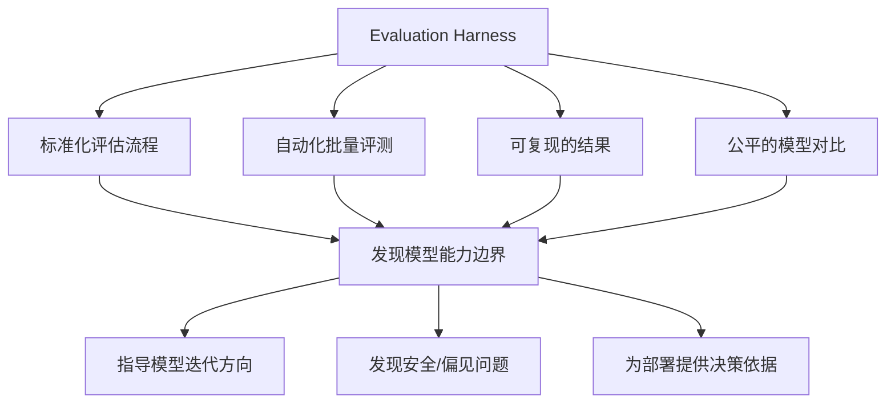

# Evaluation Harness 技术深度解析

## 1. 为什么大语言模型需要系统评估

### 1.1 模型的复杂性与不可预测性

大语言模型（LLM）本质上是建立在 **Transformer 架构**上的概率生成模型。给定一个输入序列 $x = (x_1, x_2, \ldots, x_n)$，模型输出下一个 token 的概率分布：

$$P(x_{n+1} | x_1, x_2, \ldots, x_n; \theta) = \text{softmax}(W \cdot h_n)$$

其中 $\theta$ 代表数百亿甚至数千亿的参数，$h_n$ 是最后一层隐藏状态。这种 **next-token prediction** 的训练范式虽然简单，却催生了极其复杂的 emergent abilities（涌现能力）——这些能力在训练前无法被预测，也无法通过简单的 loss 值来衡量。

> **涌现能力示例**：GPT-3 在 1.3B 参数时几乎无法做数学推理，但 175B 版本突然具备了 chain-of-thought 推理能力。这种"突然出现"的特性意味着我们必须系统性地评估才能发现模型实际具备的能力边界。

### 1.2 评估的多维性

不同于传统 NLP 模型（如 BERT 只做分类、T5 做 seq2seq），现代 LLM 需要在 **数十个维度** 上被衡量：

| 评估维度 | 示例能力 | 对应 Benchmark |
|---------|---------|---------------|
| 知识储备 | 事实记忆、常识推理 | MMLU, Natural Questions |
| 数学推理 | 算术、代数、逻辑推导 | GSM8K, MATH |
| 代码生成 | 语法正确性、功能正确性 | HumanEval, MBPP |
| 文本理解 | 阅读理解、摘要、翻译 | SQuAD, XSUM, WMT |
| 安全与对齐 | 有害内容拒绝、偏见检测 | TruthfulQA, BBQ |
| 指令遵循 | 多轮对话、工具使用 | MT-Bench, API-Bank |

> 🔗 **与《Alignment 笔记》的关联**：偏好对齐（DPO/RLHF）的效果评估需要专门的基准和方法，如 MT-Bench（多轮对话质量）、AlpacaEval（对比胜率）、SafeRLHF（安全性）等。关于对齐效果的评估基准介绍、LLM-as-Judge 的偏差缓解、多语言评估等详细内容，请参见《Alignment 技术笔记》第 8.4 节（对齐效果的评估基准）和第 8.5 节（多轮对齐的挑战与方法）。

**核心矛盾**：没有任何单一指标可以覆盖以上所有维度。模型的 loss 下降不一定意味着推理能力提升——这被称为 **loss 与能力之间的"脱钩"**。形式化地，我们定义评估的必要性为：

> 若存在两个模型 $A$ 和 $B$，其训练损失 $\mathcal{L}(A) > \mathcal{L}(B)$，但在某个下游任务 $T$ 上 $A$ 的表现显著优于 $B$，则损失函数不足以作为能力的完备代理指标，必须引入专门的评估体系。

事实上，这种现象在实践中比比皆是：Chinchilla 在更大数据上训练了更小的模型，训练 loss 更优，但在某些推理任务上不如同等规模的 GPT-3。**没有一个静态指标能预言模型在未知任务上的表现。**

---

## 2. 为什么不能只依赖人工主观评价

### 2.1 人类评价的固有局限

#### 2.1.1 一致性问题（Inter-annotator Agreement）

人工评价的 Cohen's Kappa 系数往往令人担忧。在一项针对对话系统的研究中，两个标注者之间的评分一致性通常在 $\kappa = 0.3\text{-}0.5$ 范围内，属于"中等"水平。

$$\kappa = \frac{P_o - P_e}{1 - P_e}$$

其中 $P_o$ 是观察一致率，$P_e$ 是随机一致概率。当 $\kappa < 0.4$ 时，评价结果几乎不可靠。

> **直观理解**：想象让 5 个人给一篇作文打分，可能有人关注语法、有人关注内容、有人在意风格——同样的输出在不同人眼中天差地别。这就是人工评价的核心问题。

#### 2.1.2 漂移与疲劳（Annotator Drift）

同一个标注者在上午和下午对同一组输出给出的评分可能截然不同。原因包括：
- **参考漂移**：标注者在前 10 条标注中建立了内部标准，但后续遇到更强/更弱的输出时标准会不自觉调整
- **疲劳效应**：连续标注超过 1 小时后，评分方差显著增大（研究表明方差可增大 40-60%）

#### 2.1.3 规模瓶颈

假设我们要比较 10 个模型在 20 个任务上的表现，每个任务需要 500 条样本，每条样本由 3 人标注——总共需要 $10 \times 20 \times 500 \times 3 = 300{,}000$ 条标注。按每条标注 0.5 美元计算，成本高达 15 万美元，耗时数周。

### 2.2 自动化评估的不可替代性

自动化评估（evaluation harness）提供的是 **确定性、可复现、低成本** 的比较基准：

| 特性 | 人工评价 | 自动化评估（Harness） |
|------|---------|---------------------|
| 可复现性 | 差（不同人/时间结果不同） | 完全确定（给定 seed） |
| 成本 | 高（$0.5\text{-}2/条） | 近乎零（仅算力） |
| 速度 | 慢（天-周） | 快（小时级） |
| 覆盖范围 | 有限（通常 1-2 个维度 | 数十到数百个任务 |
| 细粒度诊断 | 困难 | 可按子任务、难度分层 |

**关键结论**：人工评价和自动化评估不是替代关系，而是互补关系。自动化评估负责**筛选、基线、回归测试**，人工评价负责**最终的用户体验验证**。

---

## 3. Benchmark、Task、Metric、Few-shot Setting 的含义

### 3.1 Benchmark（基准测试集）

Benchmark 是一个**结构化的评估数据集**，定义了一组标准化的任务和评价方法。

**数学定义**：一个 Benchmark $\mathcal{B}$ 是一个三元组：

$$\mathcal{B} = (\mathcal{D}, \mathcal{T}, \mathcal{M})$$

其中 $\mathcal{D}$ 是数据集（包含输入-输出对），$\mathcal{T}$ 是任务类型定义，$\mathcal{M}$ 是评价指标集合。

**经典 Benchmark 对比**：

| Benchmark | 样本数 | 任务类型 | 评估方式 | 典型指标 | 特点 |
|-----------|--------|---------|---------|---------|------|
| MMLU | ~15,908 | 多选问答（57 学科） | 对数似然 / 生成 | Accuracy | 广度最大，覆盖人文到 STEM |
| GSM8K | ~8,500 | 数学应用题 | 生成 + 答案匹配 | Exact Match | 需要多步推理 |
| HumanEval | 164 | Python 代码生成 | 执行测试 | Pass@k | 功能正确性验证 |
| HellaSwag | ~10,000 | 句子补全 | 对数似然 | Accuracy | 需常识推理 |
| BIG-Bench | >200 tasks | 多样化 | 多样化 | 多样化 | 覆盖面最广 |
| ARC | ~7,787 | 多项选择科学问答 | 对数似然 | Accuracy | 区分难度 |
| **MMLU-Pro** | ~12,000 | 多选问答（更难的 MMLU 变体） | 对数似然 / 生成 | Accuracy | 去除简单题，减少 ceiling effect（GPT-4 在 MMLU 上已 >85%） |
| **LiveBench** | 动态更新 | 多样化（新闻、论文等最新数据） | 多样化 | 多样化 | 每月更新，防止数据污染 |
| **Arena-Hard** | 500 | 开放式对话 | GPT-4 评分 | 对比胜率 | 基于 Chatbot Arena 用户投票的硬样本，贴近人类偏好 |
| **SWE-bench** | 2,294 | 真实 GitHub Issue 解决 | 执行测试 | Resolved % | 评估 Agent 能力：代码修改 + 环境交互 |
| **GPQA** | 448 | 研究生级专业问答（物理/化学/生物） | 多项选择 | Accuracy | 极高难度，专家级问题 |

> ⚠️ **注意**：2024-2025 年涌现了一批**更挑战、更动态**的 benchmark。MMLU-Pro 解决了 MMLU 的 ceiling effect；LiveBench 每月更新数据，从根本上防止污染；SWE-bench 和 GPQA 将评估难度推到了"专家级"水平。在评估前沿模型时，建议在经典 benchmark 的基础上补充这些新基准。

> **举例**：如果把评估模型比作高考，MMLU 就像是文理综合卷（覆盖广泛但每题较浅），GSM8K 是数学大题（深度推理），HumanEval 是编程实操（应用能力）。**高考本身可以看作是一个 Benchmark，各科是 Task，分数是 Metric。**

### 3.2 Task（任务）

Task 是在一个 Benchmark 内的具体评估任务定义。它通常包含：

- **数据格式**：输入（prompt/context）和期望输出（target/label）的规范
- **评估方式**：模型如何产生输出（生成式 / 对数似然 / 混合）
- **指标计算**：如何将模型输出与标准答案比较

**常见的 Task 类型**：

1. **Perplexity-based**（困惑度评估）
   - 适用于自回归语言模型
   - 计算模型对正确答案的对数似然：$\text{score}(x) = \sum_{i=1}^{|x|} \log P(x_i | x_{<i})$
   - 优势：不需要生成，效率高
   - 典型：HellaSwag, ARC, PIQA

2. **Generative**（生成式评估）
   - 模型自由生成文本，然后与参考答案比对
   - 优势：更接近真实使用场景
   - 劣势：生成速度慢，匹配困难
   - 典型：GSM8K, HumanEval, MT-Bench

3. **Multiple-choice**（多项选择）
   - 给出几个候选项，模型选择最可能的
   - 可以是生成式（让模型输出字母）或似然式（比较每个选项的概率）
   - 典型：MMLU, ARC, TruthfulQA

### 3.3 Metric（指标）

Metric 是将模型输出 $\hat{y}$ 与参考答案 $y^*$ 比较的函数：

$$\text{metric}: (\hat{y}, y^*) \to \mathbb{R}$$

**主要指标类别**：

#### 3.3.1 分类型指标

- **Accuracy**（准确率）：$\frac{\text{正确预测数}}{\text{总预测数}}$
- **F1 Score**：$2 \cdot \frac{\text{Precision} \cdot \text{Recall}}{\text{Precision} + \text{Recall}}$

#### 3.3.2 生成型指标

- **Exact Match (EM)**：$\mathbb{1}[\text{norm}(\hat{y}) = \text{norm}(y^*)]$（标准化后精确匹配）
- **BLEU**：基于 n-gram 精确度的匹配：$\text{BLEU} = \text{BP} \cdot \exp\left(\sum_{n=1}^N w_n \log p_n\right)$，其中 $p_n$ 是 n-gram 精确率，BP 是简短惩罚
- **ROUGE-L**：基于最长公共子序列：$R_{lcs} = \frac{LCS(\hat{y}, y^*)}{|y^*|}, P_{lcs} = \frac{LCS(\hat{y}, y^*)}{|\hat{y}|}, F_{lcs} = \frac{(1+\beta^2)R_{lcs}P_{lcs}}{R_{lcs}+\beta^2P_{lcs}}$

#### 3.3.3 代码型指标

- **Pass@k**：生成 k 个解，其中至少一个通过测试的概率：
  $$\text{Pass@k} = \mathbb{E}_{\text{problems}}\left[1 - \frac{\binom{n-c}{k}}{\binom{n}{k}}\right]$$
  其中 $n$ 是总生成数，$c$ 是通过数

#### 3.3.4 概率型指标

- **Perplexity**：$PPL = \exp\left(-\frac{1}{N}\sum_{i=1}^N \log P(x_i | x_{<i})\right)$
- **Log-likelihood**：$\sum_{i=1}^N \log P(x_i | x_{<i})$

> **对比理解**：Accuracy 就像判断题的计分方式（对或错），BLEU 像是作文比赛中看句子层面的相似度，而 Pass@k 更像是"给你 k 次机会，只要有一次成功就算过"——这是很不一样的信噪比。

### 3.4 Few-shot Setting（少样本设置）

Few-shot evaluation 是指在 prompt 中加入少量示范示例（exemplars）后再让模型完成任务。

**形式化定义**：给定 $k$ 个示范样本 $(x_1, y_1), (x_2, y_2), \ldots, (x_k, y_k)$，测试输入 $x$，构造 prompt：

$$\text{prompt} = [\text{instruction}] + (x_1, y_1) + \cdots + (x_k, y_k) + x$$

**不同 shot 数量的影响**：

| 设置 | 示范数 | 适用场景 | 特点 | 示例 |
|------|-------|---------|------|------|
| 0-shot | 0 | 指令理解 | 测试模型是否能自然理解任务 | "翻译成英文：今天天气很好。" |
| 1-shot | 1 | 快速适应 | 一个例子暗示任务格式 | + "你好→Hello" |
| 3-shot | 3 | 模式确认 | 少量例子消除歧义 | + "谢谢→Thank you" + "再见→Goodbye" |
| 5-shot | 5 | 稳定表现 | 多数 benchmark 标准设 | MMLU 使用 5-shot |

> **为什么需要 few-shot？** 因为很多能力在预训练中已经习得，但需要"唤起"。Few-shot 不更新参数（$\theta$ 保持不变），只是通过 prompt 中的示例激活模型在预训练中已经建立的模式匹配能力。这与 fine-tuning 有本质区别：
>
> - **Few-shot learning**：$P(y|x, \{(x_i, y_i)\}_{i=1}^k; \theta)$，参数不变
> - **Fine-tuning**：$P(y|x; \theta')$，$\theta' = \theta - \eta \nabla_\theta \mathcal{L}(\mathcal{D}_{\text{train}})$，参数更新

**关键问题**：Few-shot 示例的选择会影响结果。研究表明同样的 5-shot 设置，不同示例选择可能导致 5-15% 的方差。因此评估时需要固定 seed 以确保复现性——这正是 evaluation harness 的重要功能之一。

---

## 4. Evaluation Harness 的作用

### 4.1 定义

**Evaluation Harness**（评估框架）是一个系统化的软件基础设施，负责**标准化、自动化、可复现地评估**大语言模型在多个 benchmark 上的表现。

它的核心功能可以用以下流程图概括：

```
原始模型（HF/API 等）
        │
        ▼
┌───────────────────────────────────────────────┐
│              Evaluation Harness                │
│                                               │
│  1. 模型加载           模型适配层（Model API）    │
│  2. 数据处理           Tokenize + Prompt 构建    │
│  3. 任务调度           任务定义 + 数据加载       │
│  4. 模型推理           批量生成 / 对数似然       │
│  5. 指标计算           匹配 / 聚合 / 标准化      │
│  6. 结果输出           表格 / JSON / 可视化      │
└───────────────────────────────────────────────┘
        │
        ▼
  标准化的评估报告
```

### 4.2 为什么需要 Evaluation Harness

没有 harness 的评估状态——即"手工评估"——存在严重问题：

#### 问题 1：Prompt 构建不一致

研究者 A 使用 `"Question: ...\nAnswer:"`，研究者 B 使用 `"Q: ...\nA:"`，结果可能不同：

$$\text{Score}(A, \text{Task}_i) \neq \text{Score}(B, \text{Task}_i)$$

仅仅因为 prompt 模板不同。Harness 保证了**所有模型使用完全相同的 prompt**。

#### 问题 2：随机性不可控

模型的解码策略（temperature、top-p、seed）未被统一时：

- 使用 `temperature=0.7` 的模型 A 和 `temperature=0.0` 的模型 B 没有可比性
- 即使同一模型，seed 不同也会导致结果波动

#### 问题 3：指标计算方式不统一

- 是否去除空格和标点？
- 多选题中提取字母还是计算所有选项的似然？
- GSM8K 的答案是否应该使用正则表达式匹配？

**每个细节的差异都在侵蚀评估结果的可比性**。

### 4.3 Harness 提供的核心保障

| 维度 | 手工评估 | Evaluation Harness |
|------|---------|-------------------|
| **Prompt 模板** | 每篇论文不同 | 统一、标准化 |
| **Seed 控制** | 经常遗漏 | 全局 seed 固定 |
| **分批次处理** | 手动管理 | 自动 batch + 缓存 |
| **指标计算** | 各种实现差异 | 学术社区公认的标准实现 |
| **结果复现** | 困难（实验记录不全） | 一键复现 |
| **扩展性** | 每新任务重新开发 | 插件式添加任务 |
| **多模型对比** | 需手动汇总 | 自动生成对比表格 |

> **类比**：Evaluation Harness 之于模型评估，就像 Python unittest / pytest 之于软件测试。没有测试框架，你可以"手动"测试——打开浏览器、点击按钮、检查结果——但这不可扩展、不可复现、不可信任。框架提供了**规范、效率和可信度**。

---

## 5. EleutherAI lm-evaluation-harness 的基本功能

### 5.1 项目概况

**EleutherAI lm-evaluation-harness** 是目前最流行的开源 LLM 评估框架，GitHub 标星超过 6k，被 Hugging Face 官方评估榜单（Open LLM Leaderboard）采用作为底层引擎。

### 5.2 核心架构

```
lm-eval/
├── lm_eval/
│   ├── models/           # 模型适配层（API 层）
│   │   ├── hf.py         # Hugging Face Transformers
│   │   ├── openai.py     # OpenAI API
│   │   ├── openai_completions.py
│   │   ├── anthropic.py  # Anthropic API
│   │   ├── gguf.py       # GGUF 本地模型
│   │   └── ...
│   ├── tasks/            # 任务定义
│   │   ├── mmlu/         # MMLU 任务
│   │   ├── gsm8k/        # GSM8K 任务
│   │   ├── hellaswag/    # HellaSwag 任务
│   │   └── ...
│   ├── metrics/          # 指标实现
│   │   ├── exact_match.py
│   │   ├── perplexity.py
│   │   └── ...
│   ├── evaluator.py      # 核心评估引擎
│   └── utils.py          # 工具函数
├── main.py               # CLI 入口
└── results/              # 结果输出目录
```

### 5.3 主要能力

1. **多模型后端支持**：HF Transformers、OpenAI、Anthropic、vLLM、GGUF、TensorFlow 等
2. **200+ 预定义任务**：涵盖 MMLU、GSM8K、HellaSwag、ARC、TruthfulQA、HumanEval 等
3. **多种评估模式**：
   - **Log-likelihood 模式**：利用模型对候选项的概率打分（高效、确定性）
   - **Generate-until 模式**：让模型自由生成直到终止条件（更接近真实使用）
4. **批量推理与缓存**：自动 batch 处理，缓存已生成结果
5. **结果聚合与输出**：支持 JSON、CSV、Markdown 表格等格式
6. **任务自定义扩展**：可通过 YAML 定义新的评估任务

### 5.4 支持的评估模式详解

#### Log-likelihood 评估（对数似然评估）

**原理**：给定上下文 $c$ 和候选项 $a_1, a_2, \ldots, a_m$，计算每个候选项的对数似然：

$$\text{score}(a_i) = \sum_{t=1}^{|a_i|} \log P(a_i^{(t)} | c, a_i^{(<t)}; \theta)$$

选择得分最高的候选项作为模型输出。**优点**：
- 确定性（temperature=0 无关，因为不采样）
- 高效（只需一次前向传播）
- 信噪比高

#### Generative 评估（生成式评估）

**原理**：让模型自回归生成文本直到终止 token，然后与参考答案比较：

$$\hat{y} = \arg\max_{y: \text{len}(y) < L} P(y | x; \theta) \quad \text{(greedy decoding)}$$

或使用 beam search、nucleus sampling 等策略。**优点**：
- 更接近实际使用场景
- 可以评估开放生成的文本

### 5.5 与其他框架对比

| 特性 | EleutherAI Harness | OpenCompass (上海AI Lab) | LM Evaluation Guide | HELM (Stanford) |
|------|-------------------|----------------------|-------------------|-----------------|
| 任务数量 | 200+ | 300+ | ~70 | ~50 |
| HF 集成 | 原生 | 原生 | 原生 | 通过 API |
| API 评估 | OpenAI/Anthropic | OpenAI/百度/文心 | OpenAI | OpenAI/各种 |
| 多模态 | 不支持 | 支持（图像） | 不支持 | 不支持 |
| 社区活跃度 | 非常高 | 中 | 低 | 中 |
| 输出格式 | JSON/CSV/Markdown | JSON/CMV/可视化 | JSON | Web 界面 |
| 自定义任务 | YAML 定义 | Python 类 | YAML | Python 类 |

### 5.6 自定义评估任务：YAML 示例

lm-eval 支持通过 YAML 文件定义新的评估任务，无需修改框架代码。以下是一个自定义问答任务的完整示例：

```yaml
# my_custom_task.yaml
task: my_custom_qa                     # 任务名称（唯一标识）
dataset_path: my_company/my_dataset    # HuggingFace 数据集路径或本地 JSONL
dataset_name: default                  # 数据集配置名（若数据集有子集）
test_split: test                       # 使用的数据划分
fewshot_split: train                   # few-shot 示例来源
num_fewshot: 3                         # few-shot 示例数量

# 输出类型：generate_until = 生成直到终止条件
output_type: generate_until

# 将数据行映射为 prompt
doc_to_text: "问题：{{question}}\n答案："

# 标准答案提取
doc_to_target: "{{answer}}"

# 生成终止条件
generation_kwargs:
  until:
    - "\n"
  max_gen_tokens: 128

# 评估指标
metric_list:
  - metric: exact_match               # 精确匹配
    aggregation: mean                  # 聚合方式（所有样本取均值）
    higher_is_better: true             # 越高越好
  - metric: f1                         # F1 分数
    aggregation: mean
    higher_is_better: true

# 可选的预处理
process_results:
  # 对模型输出做标准化后再比较
  - function: regex
    regex: "答案[：:]?\\s*([^\\n]+)"
    group: 1
```

**使用自定义任务**：

```bash
# 使用 --tasks 指定 YAML 文件路径
lm_eval \
  --model hf \
  --model_args pretrained=Qwen/Qwen2.5-7B-Instruct \
  --tasks my_custom_task.yaml \
  --num_fewshot 3 \
  --device cuda:0 \
  --output_path ./results/custom_task.json
```

> 💡 **注意**：YAML 任务文件可以放在任意位置，lm-eval 会自动加载。如果你有多个自定义任务，建议放在 `lm_eval/tasks/` 目录下统一管理。更复杂的任务（如带动态 few-shot 选择、多轮交互）可能需要使用 Python 类定义。

---

## 6. 如何用 Evaluation Harness 评估一个 Hugging Face 模型

### 6.1 安装

```bash
pip install lm-eval
```

或从源码安装最新版：

```bash
git clone https://github.com/EleutherAI/lm-evaluation-harness.git
cd lm-evaluation-harness
pip install -e .
```

> 💡 **版本说明**：本笔记以 **lm-eval v0.4.x** 为准（目前最新稳定版）。不同版本的 CLI 参数可能有细微差异（如 `--output_path` vs `--output_path`，`--model_args` 的参数格式等）。建议使用 `pip install lm-eval>=0.4.5` 安装最新稳定版。如果遇到命令不兼容，运行 `lm_eval --help` 查看当前版本支持的所有参数。

### 6.2 基础命令示例

```bash
lm_eval \
  --model hf \
  --model_args pretrained=mistralai/Mistral-7B-v0.1,trust_remote_code=True \
  --tasks mmlu \
  --device cuda:0 \
  --batch_size 4 \
  --num_fewshot 5 \
  --output_path ./results/mistral-7b-mmlu.json \
  --seed 42 \
  --log_samples
```

#### 参数逐项解释

| 参数 | 值 | 含义 |
|------|---|------|
| `--model` | `hf` | 模型类型为 Hugging Face Transformers |
| `--model_args` | `pretrained=mistralai/Mistral-7B-v0.1,...` | 传给模型的参数，pretrained 指定模型名称或路径 |
| `--tasks` | `mmlu` | 要评估的任务名称（逗号分隔，如 `"mmlu,gsm8k,hellaswag"`） |
| `--device` | `cuda:0` | 运行设备，指定第一块 GPU |
| `--batch_size` | `4` | 批大小，越大推理越快但显存需求也越大 |
| `--num_fewshot` | `5` | 每个测试样本前的示范样本数（K-shot） |
| `--output_path` | `./results/...` | 结果输出文件路径 |
| `--seed` | `42` | 随机种子，确保结果可复现 |
| `--log_samples` | （flag） | 输出每个样本的详细结果（便于诊断） |

### 6.3 输出指标解读

运行上述命令后，你会看到类似以下的输出：

```
|  Task  |Version|    Metric    |Value |   |Stderr|
|--------|------:|-------------|-----:|---|-----:|
|  mmlu  |   2.0 |acc          |0.6245|±  |0.0039|
|        |       |acc_norm     |0.6245|±  |0.0039|
```

#### 核心指标解读

##### `acc`（Accuracy - 准确率）

$$\text{acc} = \frac{\text{正确回答数}}{\text{总问题数}}$$

对于 MMLU 的 57 个学科，0.6245 意味着模型平均答对了 62.45% 的问题。随机猜测的基准确率为 25%（4 选 1），所以 62% 表明模型确实学到了知识。

**与人类对比**：
- 人类专家：~90%
- 人类大学毕业生（跨学科）：~75%
- GPT-3 175B (2020)：~43.9%
- Llama 2 70B (2023)：~68.9%
- GPT-4 (2023)：~86.4%
- Mistral 7B (2023)：~62.5%
- Llama 3 70B (2024)：~82.0%

> **如何理解 62.45%？** 想象一位高考考生面对 57 个科目的综合试卷（从法律到物理到医学），答对了 62.45% 的题目。这虽然不是不及格，但离"专家"还差得远。不过考虑到 Mistral 7B 只有 7B 参数（70 亿），这个成绩已经相当可观了。

##### `acc_norm`（Length-normalized Accuracy - 长度归一化准确率）

**为什么需要长度归一化？** 在 log-likelihood 评估中，更长的选项天然会有更低的 log-likelihood（因为负对数概率累加）：

$$\text{score}(a) = \sum_{t=1}^{|a|} \log P(a_t | \cdots)$$

如果选项 A 是 "yes"（3 tokens），选项 B 是 "no, I don't think so"（6 tokens），即使 B 是正确答案，它的总 log-likelihood 也可能更低——因为累加了更多的负值。

**归一化方式**：
$$\text{score}_{\text{norm}}(a) = \frac{1}{|a|} \sum_{t=1}^{|a|} \log P(a_t | \cdots) = \frac{\text{score}(a)}{|a|}$$

当所有选项长度相近时（如 MMLU 的 A/B/C/D 单个字母），`acc` 和 `acc_norm` 几乎相同。

##### `Stderr`（Standard Error - 标准误差）

$$\text{Stderr} \approx \sqrt{\frac{\text{acc} \cdot (1 - \text{acc})}{N}}$$

对于 MMLU 的 $N = 14{,}042$（实际子集大小），$\text{acc} = 0.6245$：

$$\text{Stderr} \approx \sqrt{\frac{0.6245 \times 0.3755}{14042}} \approx \sqrt{\frac{0.2345}{14042}} \approx 0.00409$$

**解读**：真值有 95% 的概率落在 $\text{acc} \pm 1.96 \times \text{Stderr} \approx [0.6165, 0.6325]$ 区间内。这意味着：
- 如果模型 B 得分为 0.6300，它与当前模型的差异在误差范围内——两者可能实力相当
- 如果模型 C 得分为 0.6400，超出误差区间——差异具有统计学意义

### 6.4 多任务联合评估

```bash
lm_eval \
  --model hf \
  --model_args pretrained=Qwen/Qwen2.5-7B-Instruct \
  --tasks mmlu,gsm8k,hellaswag,arc_challenge,truthfulqa \
  --device cuda:0 \
  --batch_size 8 \
  --num_fewshot 5 \
  --output_path ./results/qwen2.5-7b-full.json \
  --seed 42
```

预期输出：

```
|           Task           |Version|    Metric    |Value |   |Stderr|
|--------------------------|------:|-------------|-----:|---|-----:|
|  mmlu                    |   2.0 |acc          |0.7050|±  |0.0040|
|  gsm8k                   |   3.0 |exact_match  |0.6450|±  |0.0130|
|  hellaswag               |   2.0 |acc_norm     |0.8100|±  |0.0039|
|  arc_challenge           |   2.0 |acc_norm     |0.6000|±  |0.0090|
|  truthfulqa              |   2.0 |acc          |0.5200|±  |0.0150|
```

**诊断解读**：
- **MMLU 70.5%**：知识覆盖良好，接近更大模型水平
- **GSM8K 64.5%**：数学推理能力不错但还有很大提升空间
- **HellaSwag 81.0%**：常识推理能力优秀（随机基线 25%，人类上限 ~95%）
- **ARC-Challenge 60.0%**：科学推理中等偏上
- **TruthfulQA 52.0%**：truthfulness 仅 52%，说明模型仍有较强的"自信地胡说"倾向——**幻觉问题严重**

> **综合诊断**：该模型在常识推理（HellaSwag 81%）上表现优异，数学推理（GSM8K 64.5%）处于中等水平，但 truthfulness（TruthfulQA 52%）较低——说明**模型知道很多，但不知道自己的知识边界**。这在实际部署中需要特别注意，可能需要额外做对齐（alignment）训练。

**异常案例诊断示例**：

假设你在评估一个新微调后的模型时，发现以下异常结果：

```
| Task         | Metric | Value | 预期值  | 差距   |
|------------- |--------|-------|--------|--------|
| MMLU         | acc    | 0.68  | 0.70   | -2%    |
| GSM8K        | em     | 0.45  | 0.60   | **-15%** |
| HellaSwag    | acc_norm | 0.82 | 0.80 | +2%    |
```

**异常点**：GSM8K 分数从基线的 60% 骤降至 45%，降幅远超其他任务。

**可能的原因分析**：

| 怀疑方向 | 验证方法 | 示例 |
|---------|---------|------|
| **数据污染**（微调数据与 GSM8K 测试集分布不符） | 检查微调数据中是否有数学推理样本的格式差异 | GSM8K 需要逐步推理，若微调数据只有答案没有推理链，模型会"忘记"如何逐步推理 |
| **数学能力遗忘** | 与其他数学 benchmark（如 MATH）交叉验证 | 如果 MATH 也下降，说明数学能力整体退化；如果仅 GSM8K 下降，可能是格式不匹配 |
| **Tokenization 偏移** | 检查 GSM8K 中数字的 tokenize 方式在微调前后是否一致 | 某些 tokenizer 对多位数编码不一致（如 "123" → [1,2,3] vs [123]），导致概率估计异常 |
| **对齐税** | 对比微调前后的 logits 分布 | RLHF/DPO 训练可能抑制了"过度推理"的行为，误伤数学能力 |

**结论**：单一任务异常时，不要直接归因于模型能力下降。需要结合交叉验证、输入检查和分维度分析来定位真正原因。这种系统性的诊断思维是评估工作的核心能力。

### 6.5 评估 Hugging Face 上不公开权重的模型（API 评估）

```bash
lm_eval \
  --model local-completions \
  --model_args model=model_name,base_url=http://localhost:8000/v1/completions,num_concurrent=8 \
  --tasks hellaswag \
  --num_fewshot 5
```

这种方式适用于通过 vLLM、TGI 等部署的模型。

### 6.6 加速评估的技巧

全量评估（如 MMLU 的 57 个学科 + GSM8K + HellaSwag 等）可能耗时数天，尤其在模型规模大（70B+）或使用生成式评估时。以下优化技巧可以大幅缩短评估周期：

| 技巧 | 加速效果 | 做法 |
|------|---------|------|
| **使用 vLLM 后端** | 5-10× | `lm_eval --model vllm --model_args pretrained=...,tensor_parallel_size=2` — vLLM 的 PagedAttention 大幅提升吞吐量 |
| **启用缓存** | 避免重复计算 | `--cache_requests true` 复用 tokenized 数据，多次评估相同任务时省去重复 tokenize 时间 |
| **评估子集** | 按需加速 | `--tasks mmlu:physics` 仅评估物理子任务；先用少量样本验证代码正确性 |
| **用小模型调试** | — | 先用 7B 模型调通评估流程和指标计算，再用目标模型（70B+）做正式评估 |
| **并行 API 请求** | 线性加速 | `--model_args num_concurrent=10` 对 API 模型同时发起多个请求 |
| **使用更小的 batch** | 避免 OOM | 显存不足时降低 `--batch_size`，配合 `--model_args use_cache=True` 保持速度 |

### 6.7 结果聚合与可视化

实际工作中常需要对比多个模型的结果，生成可分享的报告。

#### 合并多个评估结果

```bash
# 依次评估多个模型
lm_eval --model hf --model_args pretrained=model_A --tasks mmlu,gsm8k --output_path ./results/model_A.json ...
lm_eval --model hf --model_args pretrained=model_B --tasks mmlu,gsm8k --output_path ./results/model_B.json ...

# 加载对比（lm-eval 支持 --results 合并多个结果文件）
# 需要自行编写聚合脚本，或用工具生成对比表
```

#### 使用 Python 对比并生成可视化

```python
import json
import pandas as pd
import matplotlib.pyplot as plt
import numpy as np

# 加载多个模型结果
def load_results(model_paths: dict[str, str]) -> pd.DataFrame:
    """从多个模型的 JSON 结果文件中提取分数"""
    rows = []
    for model_name, path in model_paths.items():
        with open(path) as f:
            data = json.load(f)
        for task, metrics in data["results"].items():
            for metric, value in metrics.items():
                if metric in ("acc", "acc_norm", "exact_match"):
                    rows.append({
                        "model": model_name,
                        "task": task,
                        "metric": metric,
                        "value": value * 100,  # 转为百分比
                    })
    return pd.DataFrame(rows)

# 生成雷达图
def plot_radar(df: pd.DataFrame, save_path: str = "comparison.png"):
    """多模型多任务对比雷达图"""
    pivot = df.pivot_table(index="model", columns="task", values="value")
    categories = pivot.columns.tolist()
    N = len(categories)
    angles = [n / float(N) * 2 * np.pi for n in range(N)]
    angles += angles[:1]

    fig, ax = plt.subplots(figsize=(8, 8), subplot_kw=dict(polar=True))
    for idx, model in enumerate(pivot.index):
        values = pivot.loc[model].values.flatten().tolist()
        values += values[:1]
        ax.plot(angles, values, "o-", label=model, linewidth=2)
        ax.fill(angles, values, alpha=0.1)

    ax.set_xticks(angles[:-1])
    ax.set_xticklabels(categories, size=10)
    ax.set_ylim(0, 100)
    ax.set_title("Model Comparison", size=14, pad=20)
    ax.legend(loc="upper right", bbox_to_anchor=(1.3, 1.0))
    plt.tight_layout()
    plt.savefig(save_path, dpi=150)
    print(f"雷达图已保存至 {save_path}")

# 使用示例
model_paths = {
    "Model A": "./results/model_A.json",
    "Model B": "./results/model_B.json",
    "Model C": "./results/model_C.json",
}
df = load_results(model_paths)
print(df.to_markdown())  # 打印 Markdown 对比表格
plot_radar(df)
```

> **替代工具**：如果不想自己写代码，可以使用 [lm-eval-results](https://github.com/.../) 或 LM Eval Harness 自带的 `utils.make_table()` 函数（加载多个结果文件后调用）自动生成对比表格。

---

## 7. 如何深入解释评估结果

### 7.1 统计显著性检验

简单的均值比较可能产生误导。需要引入统计显著性检验：

**Bootstrap 置信区间**：对结果进行 $B=10{,}000$ 次重采样，计算每个 bootstrap 样本的均值，取 $\alpha/2$ 和 $1-\alpha/2$ 分位数：

$$\hat{\theta}_{\text{lower}} = \hat{\theta}_{(\alpha/2)}^{(\text{boot})}, \quad \hat{\theta}_{\text{upper}} = \hat{\theta}_{(1-\alpha/2)}^{(\text{boot})}$$

**McNemar 检验**（配对样本，适合两个模型在相同数据上的对比）：

$$\chi^2 = \frac{(n_{01} - n_{10})^2}{n_{01} + n_{10}}$$

其中 $n_{01}$ 是模型 A 错误且模型 B 正确的样本数，$n_{10}$ 是模型 A 正确且模型 B 错误的样本数。自由度 $df=1$。

**McNemar 检验的 Python 实现**：

```python
from scipy.stats import chi2_contingency

def mcnemar_test(model_a_correct: list[bool], model_b_correct: list[bool]) -> float:
    """
    McNemar 检验：判断两个模型在配对样本上的表现是否有显著差异。
    返回 p-value，p < 0.05 表示差异显著。
    """
    # 构建 2x2 列联表
    n_00 = sum(1 for a, b in zip(model_a_correct, model_b_correct) if not a and not b)  # 都错
    n_01 = sum(1 for a, b in zip(model_a_correct, model_b_correct) if not a and b)      # A错B对
    n_10 = sum(1 for a, b in zip(model_a_correct, model_b_correct) if a and not b)      # A对B错
    n_11 = sum(1 for a, b in zip(model_a_correct, model_b_correct) if a and b)          # 都对
    
    table = [[n_00, n_01], [n_10, n_11]]
    # Yates 连续性校正
    result = chi2_contingency(table, correction=True)
    return result.pvalue  # p < 0.05 → 模型间有显著差异

# 使用示例
model_a_scores = [True, False, True, True, False, ...]  # 模型 A 每样本的正确/错误
model_b_scores = [True, True, True, False, False, ...]  # 模型 B 每样本的正确/错误
p_value = mcnemar_test(model_a_scores, model_b_scores)
print(f"McNemar p-value: {p_value:.4f}")
if p_value < 0.05:
    print("两个模型的表现存在显著差异")
else:
    print("差异未达到统计显著水平")
```

**Bootstrap 置信区间的 Python 实现**：

```python
import numpy as np

def bootstrap_ci(scores: list[float], n_iterations: int = 10000, alpha: float = 0.05):
    """计算 Bootstrap 置信区间"""
    n = len(scores)
    boot_means = np.zeros(n_iterations)
    for i in range(n_iterations):
        sample = np.random.choice(scores, size=n, replace=True)
        boot_means[i] = np.mean(sample)
    lower = np.percentile(boot_means, 100 * alpha / 2)
    upper = np.percentile(boot_means, 100 * (1 - alpha / 2))
    return lower, upper

# 使用示例：比较两个模型的置信区间是否重叠
ci_a = bootstrap_ci(model_a_accuracies)
ci_b = bootstrap_ci(model_b_accuracies)
print(f"模型 A 95% CI: [{ci_a[0]:.3f}, {ci_a[1]:.3f}]")
print(f"模型 B 95% CI: [{ci_b[0]:.3f}, {ci_b[1]:.3f}]")
if ci_a[1] < ci_b[0] or ci_b[1] < ci_a[0]:
    print("置信区间不重叠，差异显著")
else:
    print("置信区间重叠，差异可能不显著")
```

### 7.2 分维度分析

单一聚合值会掩盖重要差异。例如 MMLU 可以按学科分组分析：

```python
# 伪代码概念
results_per_category = {
    "STEM": avg([physics, chemistry, biology, ...]),
    "Humanities": avg([history, literature, philosophy, ...]),
    "Social Sciences": avg([law, economics, sociology, ...]),
    "Other": avg([business, medicine, ...]),
}
```

*模式发现示例*：

| 学科类别 | 模型 A | 模型 B | 差距 |
|---------|-------|-------|------|
| STEM | 0.62 | 0.71 | -0.09 |
| 人文 | 0.71 | 0.63 | +0.08 |
| 社科 | 0.68 | 0.67 | +0.01 |

**诊断**：模型 A 在人文上表现更好（可能因为训练数据中人文作品更多），模型 B 在 STEM 上更强（可能因为代码/数学数据占比更高）。单一 MMLU 总分 0.67 vs 0.67 **掩盖了这个重要的特性差异**。

### 7.3 Score Distribution（分数分布）

除了均值之外，还应关注方差：

$$\text{Var}(\text{score per sample})$$

高方差可能表明模型在某些样本上极其优秀而在其他样本上严重失败——这种"不稳定"在真实部署中可能是致命的。

### 7.4 Calibration（校准度）

模型是否"知道"自己何时正确？定义校准误差：

$$\text{ECE} = \sum_{m=1}^{M} \frac{|B_m|}{n} |\text{acc}(B_m) - \text{conf}(B_m)|$$

其中 $B_m$ 是第 $m$ 个置信度区间桶，$\text{conf}(B_m)$ 是该桶内模型预测的平均置信度，$\text{acc}(B_m)$ 是该桶的实际准确率。

> **举例**：如果模型对所有回答都说"我 90% 确定"，但实际上只有 60% 答对——这就是**过度自信**，ECE 会很大。TruthfulQA 就是为了捕获这类现象而设计的。

### 7.5 与基线的对比

评估结果必须放在上下文中才有意义：

```
Model Performance vs Baselines:
  Random:             0.25  (random guessing)
  Human expert:       0.90
  GPT-3 175B:         0.44
  Mistral 7B (ours):  0.62 ←
  Llama 2 7B:         0.46
  Llama 2 13B:        0.55
  Llama 3 8B:         0.66
  GPT-4:              0.86
```

**结论**：Mistral 7B 以 7B 参数超越了 13B 的 Llama 2，说明其训练策略（更大的 token 数、更好的数据质量）取得了显著收益。

---

## 8. Evaluation Harness 的局限性

### 8.1 Benchmark 污染（Data Contamination / Benchmark Leakage）

**定义**：预训练数据可能包含了 benchmark 数据集的测试集，导致模型不是在"推理"而是在"记忆"。

**数学表达**：假设模型在训练中见过测试样本 $(x, y^*)$，其条件概率不再反映泛化能力：

$$P(y | x; \theta) \to 1 \quad \text{不是因为推理，而是因为记忆}$$

**实际检出方法**：
- **n-gram 匹配**：检查训练数据中是否有与测试样本 n-gram 重叠的部分。常用 13-gram 作为阈值——如果测试样本中出现 13 个连续的 token 与训练数据匹配，则视为可能污染
- **Perplexity 差异**：如果模型对某个 benchmark 样本的 perplexity 异常低（显著低于同分布的其他样本），可能意味着模型"见过"该答案
- **Membership Inference**：基于 Loss 的成员推断攻击，判断特定样本是否在训练集中

**n-gram 污染检测的代码示例**（使用 GPT-NeoX 的 contamination 检测工具）：

```python
from lm_eval.api.task import detect_contamination  # lm-eval 内置接口（部分版本）
# 或手动实现
def check_ngram_contamination(test_text: str, train_text: str, n: int = 13) -> bool:
    """检查测试样本是否与训练数据有 n-gram 重叠"""
    test_ngrams = set(zip(*[test_text.split()[i:] for i in range(n)]))
    train_ngrams = set(zip(*[train_text.split()[i:] for i in range(n)]))
    overlap = test_ngrams & train_ngrams
    contamination_rate = len(overlap) / len(test_ngrams)
    return contamination_rate > 0.5  # 超过 50% 的 n-gram 重叠视为污染

# 批量检查
for sample in test_dataset:
    for doc in train_corpus:
        if check_ngram_contamination(sample["text"], doc):
            print(f"WARNING: 样本 {sample['id']} 可能被污染")
```

**开源工具**：
- **GPT-NeoX contamination 检测脚本**：EleutherAI 提供的 n-gram 匹配工具
- **lm-eval 内置检测**：部分 lm-eval 版本支持 `--check_integrity` 参数自动检测污染
- **DataPortrait**：专门的数据集污染分析工具

**严重程度**：研究发现在某些流行 benchmark 上，多个开源模型的训练数据中存在高达 5-10% 的测试集重叠（如 GSM8K 在 Common Crawl 中频繁出现）。这意味着 benchmark 分数可能被 **高估 5-15%**。

> **类比**：学生如果期末考试前拿到了试卷答案，考了满分也说明不了能力——benchmark 污染就是类似的问题。正因为如此，需要不断推出**新**的 benchmark（如 MMLU-Pro、LiveBench 等动态更新的评测集），并定期对模型做污染检测。

### 8.2 有限的评估维度

当前 benchmark 主要评估"静态知识"和"推理能力"，忽略了许多重要维度：

| 缺失维度 | 重要性 | 原因 | 目前方案 |
|---------|-------|------|---------|
| **多轮对话能力** | 极高 | 实际使用多是多轮交互 | MT-Bench, Multi-turn |
| **指令遵从细微差异** | 高 | 用户提供复杂约束时是否严格遵守 | IFEval |
| **长文档理解** | 高 | 现实中有大量长文档任务 | LongBench, L-Eval |
| **工具使用能力** | 高 | Agent 使用需要 | API-Bank, ToolBench |
| **Agent 交互能力** | 极高 | 需多轮交互、环境反馈、工具调用；与单轮静态评估范式完全不同 | SWE-bench, AgentBench, WebArena |
| **多语言能力** | 中 | 非英语语言覆盖 | MMMLU, Flores |
| **多模态理解** | 高 | VLM 需评估图文理解能力 | MMMU, MMBench, SEED-Bench, MME |
| **生成创造力** | 中 | story telling 等 | 无标准化 benchmark |
| **计算效率** | 高 | 实际部署的关键 | 无标准化 benchmark |

> **关于 Agent 评估的补充说明**：Agent（如 SWE-agent、OpenDevin、AutoGPT）的评估范式与标准 LLM 评估有本质区别——不是"给一个输入得到一个输出"，而是**多轮交互 + 环境反馈 + 工具调用**的闭环。核心挑战包括：环境依赖（需要真实的 sandbox 环境）、执行成本（每次评估需运行代码或浏览网页）、确定性复现（环境状态管理）。SWE-bench（真实 GitHub issue 修复）是当前最有影响力的 Agent 评估基准，它要求模型在隔离的 Docker 环境中完成代码修改并运行测试，更接近真实开发场景。WebArena 则面向网页交互类 Agent，需要模型在模拟浏览器中完成复杂任务（如购物、信息检索）。

### 8.3 评估方式与真实使用不一致

Log-likelihood（对数似然）评估与生成式评估之间可能存在巨大差异：

| 特性 | Log-likelihood | Generation |
|------|---------------|-----------|
| 计算方式 | 单次前向传播 | 自回归逐步生成 |
| 速度 | 快 | 慢 10-100x |
| 确定性 | 完全确定 | 受采样策略影响 |
| 与真实使用匹配度 | 低 | 高 |
| 典型任务 | MMLU, ARC, HellaSwag | GSM8K, HumanEval, MT-Bench |

> **关键问题**：同一个模型在 log-likelihood 模式下 MMLU 得分 70%，但在实际对话中可能表现远差于此——因为真实场景是**生成式**的，模型需要自主产生回答，而不是从给定的 4 个选项中挑选。"能识别正确答案"和"能生成正确答案"是两种不同的能力。

### 8.4 聚合指标的信息损失

当几百个学科的分数被揉合成一个数字时，细节丢失了。

**辛普森悖论**（Simpson's Paradox）：聚合数据中的趋势可能在子分组中反转或消失。

**数学示例**：

| 学科 | 模型 A (正确/总数) | 模型 B (正确/总数) |
|------|------------------|------------------|
| 物理 | 90/100 (90%) | 80/100 (80%) |
| 法律 | 10/100 (10%) | 5/50 (10%) |
| **总计** | **100/200 (50%)** | **85/150 (56.7%)** |

模型 A 的物理和法律分别等于或优于模型 B，但**总准确率低于模型 B**——因为模型 A 的法律样本量比 B 大两倍（100 vs 50），拖低了加权平均值。**只看 aggregate 结论会产生误导**。

### 8.5 任务定义的歧义

不同版本的 benchmark 定义可能导致评分差异：

- MMLU 有 v1, v1.1, v2 版本
- GSM8K 有 main, socratic 等版本
- ARC 有 easy 和 challenge 版本

**版本控制**是 evaluation harness 的重要但容易被忽视的功能。lm-evaluation-harness 中的 `Version` 字段就是为了应对这个问题（见前述输出中的 `Version` 列）。

### 8.6 未捕获的反转现象（Inversion）

**已知问题**：某些 benchmark 上的排名与人类偏好排名不一致。

- **案例**：微调后的指令模型在 MMLU 上可能下降 1-2%，但在用户盲测中胜率提高 30%+
- **原因**：对齐训练（RLHF/DPO）可能会略微降低模型的知识准确度但大幅提升输出格式、风格、安全性
- **启示**：benchmark 分数不能等同于模型质量

**形式化表示**：

$$\text{Rank}_{\text{benchmark}}(M_1, M_2) \neq \text{Rank}_{\text{human}}(M_1, M_2)$$

当这种反转发生时，说明 benchmark 没有覆盖到人类关心的关键维度。

### 8.7 可复现性危机

即使使用 evaluation harness，复现性仍然受到以下因素的影响：

1. **GPU 精度**：FP16 vs BF16 vs FP32 会导致微小但可能系统性的差异
2. **Transformers 库版本**：不同版本的模型加载方式不同，可能影响 logits
3. **Flash Attention**：启用/禁用可能改变输出
4. **Tokenizer 差异**：tokenizer 的版本更新可能会改变字符串的编码方式

**最佳实践**：

```
复现实验时需记录的环境信息：
- lm-eval 版本: v0.4.5
- PyTorch 版本: 2.1.0
- Transformers 版本: 4.36.2
- CUDA 版本: 12.1
- GPU 型号: A100-80GB
- 精度: float16
- Flash Attention: True
- Seed: 42
- Batch Size: 4
```

#### 可复现性检查清单模板

以下是一个可直接复制到实验文档中的检查清单模板：

```markdown
## 实验复现信息

| 项目 | 值 |
|------|-----|
| **评估目的** | |
| **lm-eval 版本** | v0.4.x |
| **PyTorch 版本** | |
| **Transformers 版本** | |
| **CUDA 版本** | |
| **GPU 型号** | |
| **精度设置** | float16 / bfloat16 / float32 |
| **Flash Attention** | True / False |
| **随机种子** | |
| **Batch Size** | |
| **模型名称/路径** | |
| **任务列表** | |
| **Few-shot 数量** | |
| **评估日期** | |
| **备注** | |
```

---

## 9. 总结与展望

### 9.1 Evaluation Harness 的核心价值



### 9.2 当前的挑战与未来方向

| 挑战 | 当前状态 | 理想方向 |
|------|---------|---------|
| 静态 benchmark 过拟合 | 模型针对已知 benchmark 优化 | 动态生成、不可见数据集 |
| 评估维度偏窄 | 偏重知识记忆和基础推理 | 涵盖创造力、工具使用、长期记忆 |
| 与人类偏好脱节 | benchmark 排名 ≠ 用户满意度 | 建立 benchmark ↔ 人类偏好映射 |
| 评估成本高 | 全量评估需大量 GPU | 自适应采样、代理指标 |
| 多语言/多文化不足 | 英语为中心 | 覆盖更多语言和文化背景 |
| Agent 能力评估不足 | 缺乏标准化 agent 评估 | Agent-bench, SWE-bench 等新范式 |

### 9.3 最后的建议

1. **永远不要只看一个 benchmark**：单一指标无法反映模型全貌
2. **关注趋势而非绝对值**：不同版本、不同 seed 下结果会有波动，关注相对排名和稳定性
3. **结合定性分析**：再好的定量指标也需要结合 bad case 分析
4. **考虑评估成本**：全量评估可能耗时数天，可以先用部分子集快速迭代
5. **保持怀疑**：benchmark 分数高不等于模型好——"当 benchmark 成为目标，它就不再是好的 benchmark"（Goodhart's Law）

---

> **参考文献与扩展阅读**：
> 1. EleutherAI lm-evaluation-harness: https://github.com/EleutherAI/lm-evaluation-harness
> 2. Liang et al., "Holistic Evaluation of Language Models" (HELM), 2022
> 3. Srivastava et al., "Beyond the Imitation Game: Quantifying and Extrapolating the Capabilities of Language Models" (BIG-Bench), 2022
> 4. Hendrycks et al., "Measuring Massive Multitask Language Understanding" (MMLU), 2020
> 5. Cobbe et al., "Training Verifiers to Solve Math Word Problems" (GSM8K), 2021
> 6. Gao et al., "A Framework for Few-Shot Language Model Evaluation", 2023
